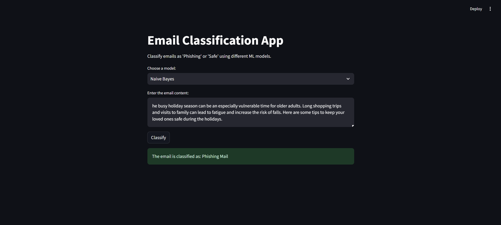

# Phishing Email Detection Framework using NLP and ML

## Introduction

This project develops a **Phishing Email Detection Framework** using **Natural Language Processing (NLP)** and **Machine Learning (ML)**. By analyzing email content and structure, the framework differentiates phishing emails from legitimate ones with high accuracy. Both traditional ML models and advanced Deep Learning (DL) architectures are implemented to compare their performance.



---

## Features

- **Phishing Email Classification**: Identifies phishing emails using NLP techniques.
- **Multi-Model Approach**: Includes ML models like Logistic Regression, Random Forest, and XGBoost, and DL models like LSTM and GRU.
- **Transfer Learning**: Utilizes pre-trained models like DistilBERT from Hugging Face for improved performance.
- **NLP Preprocessing**: Incorporates advanced preprocessing techniques like tokenization, POS tagging, and NER.
- **Data Augmentation**: Balances datasets using Random Oversampling for unbiased predictions.
- **Detailed Evaluation**: Reports performance metrics like accuracy, precision, recall, and F1-score for each model.

---

## Dataset

The dataset comprises emails labeled as "phishing" or "legitimate," sourced from **Kaggle**. It includes features like:

- **Email Text**: Primary content used for classification.
- **Labels**: Binary labels (`1` for phishing, `0` for legitimate).

Key preprocessing steps include:

1. **Duplicate and Null Value Removal**  
2. **Text Cleaning** (removing URLs, punctuations, and extra spaces)  
3. **Vectorization** using **TF-IDF** for feature extraction.  

---

## Models

### 1. Machine Learning Models
- Naive Bayes
- Logistic Regression
- SGD Classifier
- XGBoost
- Decision Tree
- Random Forest
- MLP Classifier

### 2. Deep Learning Models
- Simple RNN
- LSTM
- Bi-Directional LSTM
- Stacked GRU

### 3. Pre-trained Transformer
- **DistilBERT** from Hugging Face for sequence classification tasks.

---

## How to Run

Follow these steps to set up and execute the Phishing Email Detection Framework:

### 1. Clone the Repository
Clone the repository to your local machine using the following command:
```bash
git clone <repository_url>
cd <repository_folder>
```

### 2. Install Dependencies
Ensure Python is installed on your system. Install all required dependencies using:
```bash
pip install -r requirements.txt
```

### 3. Run app
Run the following command to run the streamlit app:
```bash
streamlit run app.py
```

---

## Acknowledgments

Special thanks to **Dr. Gaurav Sharma** for guidance and Kaggle for the dataset. Hugging Face's resources were instrumental in implementing transfer learning with DistilBERT.


